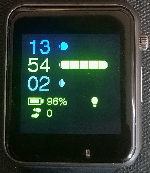
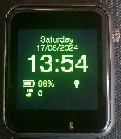
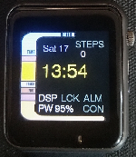
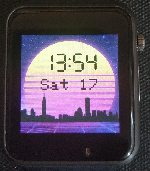
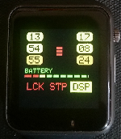
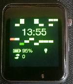
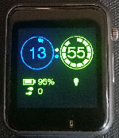

# cyberWatch

Simple OS for [LILYGO® T-WATCH-2020 V3](https://www.lilygo.cc/products/t-watch-2020-v3), based on [ Xinyuan-LilyGO /TTGO_TWatch_Library](https://github.com/Xinyuan-LilyGO/TTGO_TWatch_Library). Partially support for LILYGO® T-WATCH-2020 V2

Free time project to create lightweight and simple OS for smartwatch, with only necessary small functionality (to keep it simple and effective). With strong DIY cyberpunk motivation (don't want to support and pay money to big corporations). And with cool 80' cyberpunk retro design!

[https://cyberwatch.cyberdeck.cz/](https://cyberwatch.cyberdeck.cz/)

## Features

 - cool __cyberpunk / retrowave vibes__
 - multiple __watchfaces__
 - some __usefull apps__ (with cool app menu available by swipe up on watch face)
	- 3slot alarm
	- stopwatch
	- flashlight
	- simple calculator
	- calendar
 - for full list of features, see [changelog.txt](changelog.txt)
 - synchronize date & time with computer during compile/upload

## Screenshots

## Installation

 - download and install [VS Code](https://code.visualstudio.com/download) and [PlatformIO](https://platformio.org/install/ide?install=vscode) (or any other C/C++ IDE)
    - (use complex IDE; this project is too large fro Arduino IDE)
 - ~~clone~~ download this repository
 - add [TTGO library](https://github.com/Xinyuan-LilyGO/TTGO_TWatch_Library) to the project, following instructions in library's readme
 - connect [LillyGo T_Watch device](http://www.lilygo.cn/prod_view.aspx?TypeId=50053&Id=1380&FId=t3:50053:3) via USB
 - compile and upload via your favorite IDE
 - __have a fun!__
 - __screen is autolocked (prevention of random touch) - if there is a lock icon, press crown (button) to unlock it!__

## Known bugs
 - "tilt up" maneuver sometimes doesn't activate display (maybe will be solved by tuning BMA423 sensor)

## Code quality & standards
 - [Misra C++ standards](https://www.misra.org.uk/) (98% and still improving)

## Future features :-)
 - step counter app with steps walk/run, stats over last few days
 - wifi netowrks scannner
 - conection vith phone via BT (require app for android)
   - SMS notification icon
   - missed call icon
   - other notifications icon
   - show who's calling
     - ability to reject call
   - show SMS content (and mark as read in phone)
   - show notifications (and mark as read)
 - __many many more__

## Contact

Feel free to contact me via email (spaceangel@cyberdeck.cz ) if you need some help, want to participate or support me :-)
